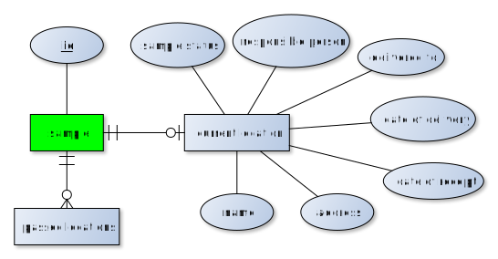

# Sample-Tracking Service
Service that implements a sample tracking interface.

## Micronaut app
This service is build with [micronaut](https://micronaut.io):

```
mn create-app life.qbic.sampletracking --features=groovy --build maven
```

### Run locally

```
./mvnw compile
./mvnw exec:exec
```

### Execute tests

```
./mvnw test 
```

## Data model
The data model that holds sample tracking information is defined by attributes and relations shown in the following ER diagram.



## API design
The remote [RESTful API](https://app.swaggerhub.com/apis-docs/qbic/sample-tracking) is created with [swagger.io](https://swagger.io/).

## Authentication

The roles and user tokens must be provided in a file following the YAML format specification.
An exemplary entry looks like this:

```
servicereader:
    token: 123!
    roles:
        - READER
    servicewriter:
        token: 123456!
        roles:
            - READER
            - WRITER
```

### Retrieve sample information from sampleID
The accepted input formats are listed in the following
To obtain tracking information for a given sample id
```
{
"sampleId":"QABCD12AE"
}
### Set current location for a sample from sampleID
```
To set the current location for a sample with the given identifier
```
{
    "sampleId":"QABCD12AE",
    "location":{
        "name": "Max Mustermann",
        "responsiblePerson": "Max Mustermann",
        "responsibleEmail": "max.mustermann@uni-tubingen.de",
        "address"{
            "affiliation": "QBiC",
            "street": "Auf der Morgenstelle 6",
            "zipCode": 72076,
            "country": "Germany"
        },
        "status":["SAMPLE_QC_FAIL", "SAMPLE_QC_PASS", "SAMPLE_RECEIVED", "LIBRARY_PREP_FINISHED", "SEQUENCING",
                    "SEQUENCING_COMPLETE", "METADATA_REGISTERED", "WAITING", "PROCESSING", "FAILED_QC", "PROCESSED",
                    "DATA_AVAILABLE",],
        arrivalDate:{
            "year": 2021,
            "month": 10, 
            "date": 5, 
            "hrs": 15, 
            "min": 00
        },
        forwardDate:{
            "year": 2021,
            "month": 10, 
            "date": 5, 
            "hrs": 15, 
            "min": 00
        }
    }
}
```
### Retrieve contact Information from email address

**NOTE: This method is deprecated and will be removed in future versions** 
To retrieve contact information based on a given email address
```
"email": "max.mustermann@uni-tubingen.de"
```
To retrieve location information for a given user id
```
"user_id": "qabcd04"
```


