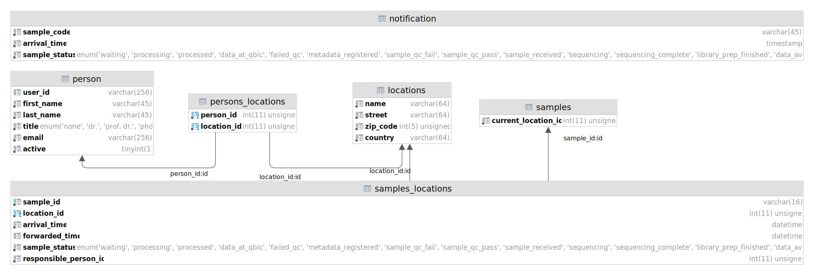
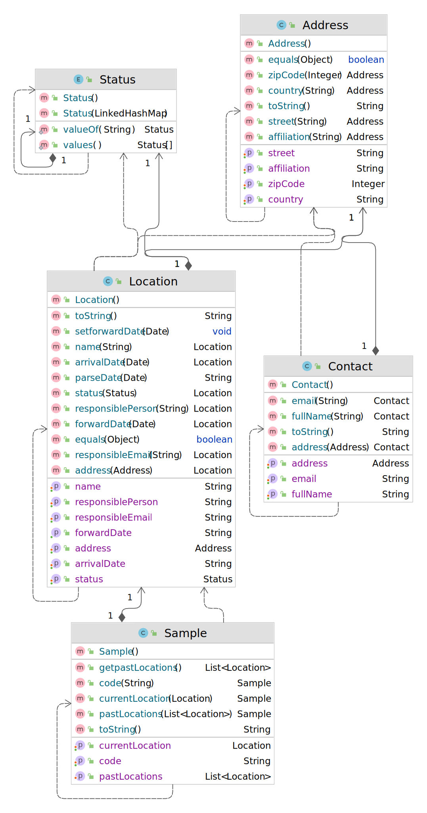

<div align="center">

# Sample-Tracking Service
<i>A service implementing a sample-tracking interface</i>.


[](https://github.com/qbicsoftware/sample-tracking-service/actions/workflows/build_package.yml)
[](https://github.com/qbicsoftware/sample-tracking-service/actions/workflows/run_tests.yml)
[](https://github.com/qbicsoftware/sample-tracking-service/actions/workflows/codeql-analysis.yml)
[](https://github.com/qbicsoftware/sample-tracking-service/releases)

[](https://github.com/qbicsoftware/sample-tracking-service/blob/main/LICENSE)


</div>

- [System Integration](#system-integration)
  - [Data Model](#data-model)
- [How to run](#how-to-run)
  - [Configuration](#configuration)
    - [Properties](#properties)
    - [Environment variables](#environment-variables)
- [How to use](#how-to-use)
  - [Authentication](#authentication)
  - [Api design](#api-design)
    - [Common response codes](#common-response-codes)
    - [Endpoint format](#endpoint-format)
    - [Retrieve sample information from sampleID](#retrieve-sample-information-from-sampleid)
    - [Update Sample Status of current location from sampleId and sample status](#update-sample-status-of-current-location-from-sampleid-and-sample-status)
    - [Retrieve location information for an userId](#retrieve-location-information-for-an-userid)
    - [Update current location of sampleId](#update-current-location-of-sampleid)
    - [Retrieve complete location to user linked information](#retrieve-complete-location-to-user-linked-information)
    - [Retrieve contact Information from email address](#retrieve-contact-information-from-email-address)
- [License](#license)

## System Integration

This application requires a database configured to reflect this [data model](#data-model).
### Data model

The data model that holds sample tracking information is defined by attributes and relations shown
in the following ER diagram.


In the service application however, those attributes are mapped to API classes:



## How to run

To build, package and run the sample-tracking service, the service needs configuration. For more
details on configuration, see the [configuration section](#configuration).

Checkout the latest code from `master` and run the maven goal `mvn clean jetty:run` starting the application on your machine.

Alternatively you can package the application and run it as `.jar`. First compile the project and
build an executable java archive:

```shell
mvn clean package
```

The JAR file will be created in the ``/target`` folder:

```
|-target
|---sampletracking-1.0.0-jar-with-dependencies.jar
|---...
```

Now change into the folder and run the sample tracking service with:

```shell
java -jar sampletracking-1.0.0-jar-with-dependencies.jar
```

### Configuration

#### Properties

The default configuration of the app binds to the local port 8080 to the systems localhost:

```
http://localhost:8080
```

If you want to change the server port, let's say `8085`, you can configure it by setting the
`server.port` property explicitly:

```
java -jar -Dserver.port=8085 sampletracking-1.0.0-jar-with-dependencies.jar
```

#### Environment Variables

For the application to use the database the following information is read from environment
variables:

| environment variable | description                               |
|----------------------|-------------------------------------------|
| `TR_DB_HOST`         | The sample tracking database host address |
| `TR_DB_USER`         | The sample tracking database user         |
| `TR_DB_PWD`          | The sample tracking database user         |
| `TR_DB_NAME`         | The sample tracking database name         |

### Authentication

A user-role definition is needed. By default, a file is expected at `/etc/micronaut.d/userroles.yml`
. The file follows YAML format specification and can look like this:

```
---
servicereader:
  token: 123!    // replace with your token
  roles:
    - READER
servicewriter:
  token: 123456! // replace with your token
  roles:
    - READER
    - WRITER
...
```

## How to use

### API design

#### Common response codes

The Response codes in the sample-tracking API follow
the [REST API status code](https://restfulapi.net/http-status-codes/) terminology:

| RESPONSE CODE | TEXT                  | Purpose   | 
| -----------   | -----------           | --------- |
| 200           | OK                    | For successful GET and PUT requests.| 
| 201           | Created               | The request has created a new resource| 
| 400           | Bad Request           | Issued when a malformed request was sent.| 
| 401           | Unauthorized          | Sent when the client provided invalid credentials| 
| 404           | Not Found             | The accessed resource doesn't exist or couldn't be found.| 
| 500           | Internal Server Error | When an error has occurred within the API.| 

#### Endpoint format
The endpoints formatting follows the [OpenAPI Specifications](https://swagger.io/specification/)

#### Retrieve sample information from sampleID
Gets the sample information including current and past locations for a specific sample ID in JSON format

##### Endpoint
```
  /samples/{sampleId}:
    get:
      summary: "GET samples/{sampleId}"
      parameters:
      - name: "sampleId"
        in: "path"
      responses:
        "200":
          description: "OK"
```

##### Example Request

```
/sample/QMUJW064AW
```

##### Example Response
```
{
  "code": "QMUJW064AW",
  "current_location": {
    "name": "QBiC",
    "responsible_person": "John Doe",
    "responsible_person_email": "John.Doe@Templa.te",
    "address": {
      "affiliation": "QBiC",
      "street": "Auf der Morgenstelle 10",
      "zip_code": 72076,
      "country": "Germany"
    },
    "sample_status": "METADATA_REGISTERED",
    "arrival_date": "2019-12-03T10:32Z"
  }
}
```

#### Update Sample Status of current location from sampleId and sample status

Updates the status set in the current location of the provided sampleId with the provided sample status.

##### Endpoint
```
  /samples/{sampleId}/currentLocation/{status}:
    put:
      summary: "PUT samples/{sampleId}/currentLocation/{status}"
      parameters:
      - name: "sampleId"
        in: "path"
      - name: "status"
        in: "path"
      responses:
        "201":
          description: "OK"
```

##### Example Request

```
/samples/QMUJW064AW/currentLocation/data_available/
``` 

##### Example Response

``` 
Response code: 201 (Sample status updated to DATA_AVAILABLE.)
``` 

#### Retrieve location information for an userId

Gets the location information for a given user id in JSON Format:

##### Endpoint

```
  /locations/{user_id}:
    get:
      summary: "GET locations/{user_id}"
      parameters:
      - name: "user_id"
        in: "path"
      responses:
        "200":
          description: "OK"
```

##### Example Request

```
/locations/John.Doe@Templa.te
```

##### Example Response
```
[
  {
    "name": "QBiC",
    "responsible_person": "John Doe",
    "responsible_person_email": "John.Doe@Templa.te",
    "address": {
      "affiliation": "QBiC",
      "street": "Auf der Morgenstelle 10",
      "zip_code": 72076,
      "country": "Germany"
    }
  },
  {
    "name": "Awesome Partner Lab",
    "responsible_person": "John Doe",
    "responsible_person_email": "John.Doe@Templa.te",
    "address": {
      "affiliation": "Partner Labs",
      "street": "Example Street 5",
      "zip_code": 12345,
      "country": "ImaginationLand"
    }
  },
  {
    "name": "Splendid Facility",
    "responsible_person": "John Doe",
    "responsible_person_email": "John.Doe@Templa.te",
    "address": {
      "affiliation": "Partner Facilities",
      "street": "Example Lane 10",
      "zip_code": 12345,
      "country": "ImaginationLand"
    }
  }
]
```

#### Update current location of sampleId

Updates the current location of a provided sampleId with the provided location information. 

##### Endpoint
```
  /samples/{sampleId}/currentLocation/:
    post:
      summary: "POST samples/{sampleId}/currentLocation/"
      parameters:
      - name: "sampleId"
        in: "path"
      responses:
        "200":
          description: "OK"
```

##### Example Request

```
/samples/QMUJW064AW/currentLocation/
```

Additionally, the location information has to be provided in the JSON Format: 

```
{
  "name":"Example Location Name",
  "responsible_person":"Max Mustermann",
  "responsible_person_email":"max.mustermann@uni-tubingen.de",
  "address":{
    "affiliation":"QBiC",
    "street":"Auf der Morgenstelle 6",
    "zip_code":72076,
    "country":"Germany"
  },
  "sample_status":"WAITING",
  "arrival_date":"2021-12-07T09:38Z",
  "forward_date":"2021-12-07T09:38Z"
}
```

**NOTE: The provided location information should be stripped of all newlines("\n"), otherwise it can't be interpreted by the sample-tracking-service**

##### Example Response

The sample-tracking-service will return the set location information: 

```
{
  "name":"Example Location Name",
  "responsible_person":"Max Mustermann",
  "responsible_person_email":"max.mustermann@uni-tubingen.de",
  "address":{
    "affiliation":"QBiC",
    "street":"Auf der Morgenstelle 6",
    "zip_code":72076,
    "country":"Germany"
  },
  "sample_status":"WAITING",
  "arrival_date":"2021-12-07T09:38Z",
  "forward_date":"2021-12-07T09:38Z"
}
```

#### Retrieve complete location to user linked information

Gets all the location to users linked information in JSON format

##### Endpoint

```
  /locations/:
    get:
      summary: "GET locations/"
      responses:
        "200":
          description: "OK"
```

##### Example Request

```
/locations/
```

##### Example Response
```
[
  {
    "name": "QBiC",
    "responsible_person": "John Doe",
    "responsible_person_email": "John.Doe@Templa.te",
    "address": {
      "affiliation": "QBiC",
      "street": "Auf der Morgenstelle 10",
      "zip_code": 72076,
      "country": "Germany"
    }
  },
  {
    "name": "Awesome Partner Lab",
    "responsible_person": "John Doe",
    "responsible_person_email": "John.Doe@Templa.te",
    "address": {
      "affiliation": "Partner Labs",
      "street": "Example Street 5",
      "zip_code": 12345,
      "country": "ImaginationLand"
    }
  },
  {
    "name": "QBiC",
    "responsible_person": "Erika Musterfrau",
    "responsible_person_email": "Erika@MusterFr.au",
    "address": {
      "affiliation": "QBiC",
      "street": "Auf der Morgenstelle 10",
      "zip_code": 72076,
      "country": "Germany"
    }
  },
  {
    "name": "Splendid Facility",
    "responsible_person": "Erika Musterfrau",
    "responsible_person_email": "Erika@MusterFr.au",
    "address": {
      "affiliation": "Partner Facilities",
      "street": "Example Lane 10",
      "zip_code": 12345,
      "country": "ImaginationLand"
    }
  },
  }]
```

#### Retrieve contact Information from email address

**NOTE: This method is deprecated and will be removed in future versions**

Gets the linked affiliation and person information for an email address in JSON Format:

##### Endpoint
```
  /locations/contacts/{email}:
    get:
      summary: "GET locations/contacts/{email}"
      deprecated: true
      parameters:
      - name: "email"
        in: "path"
      responses:
        "200":
          description: "OK"
```

##### Example Request

```
/locations/contacts/John.Doe@Templa.te
```

##### Example Response
```
{
  "full_name": "John Doe",
  "address": {
    "affiliation": "QBiC",
    "street": "Auf der Morgenstelle 10",
    "zip_code": 72076,
    "country": "Germany"
  },
  "email": "John.Doe@Templa.te"
}
```

## License

This work is licensed under the [MIT license](https://mit-license.org/).

**Note**: This work uses the [Spring Framework](https://github.com/spring-projects) and derivatives from the Spring framework family, which are licensed under [Apache 2.0](https://www.apache.org/licenses/LICENSE-2.0).

